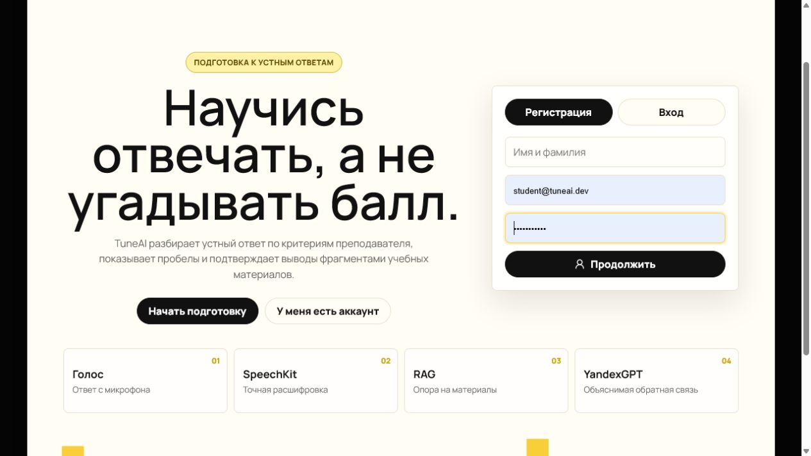
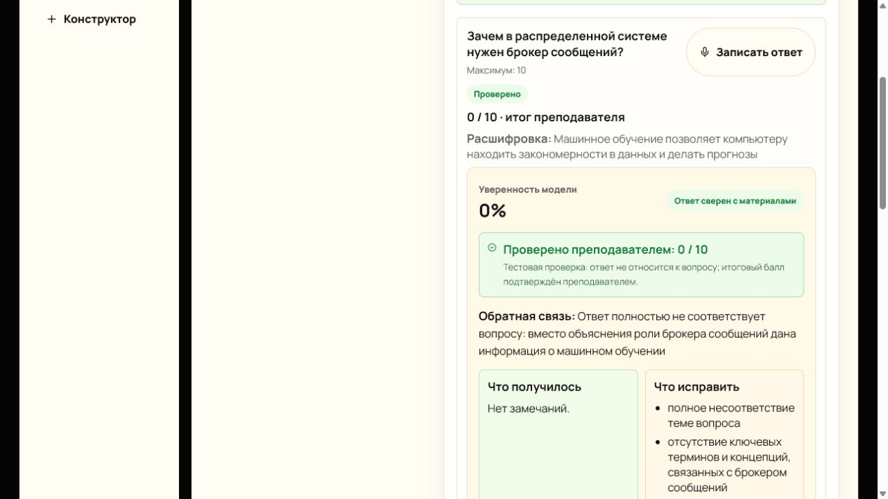

<div align="center">
  

  <h1>TuneAI</h1>

  <p><strong>Open-source движок устных тестов, подготовки, RAG-проверки и AI-оценивания ответов.</strong></p>

  <p>
    
    
    
    
    
    
  </p>

  <p>
    <a href="#быстрый-запуск">Быстрый запуск</a> ·
    <a href="#возможности">Возможности</a> ·
    <a href="#сценарии">Сценарии</a> ·
    <a href="#архитектура">Архитектура</a> ·
    <a href="#проверка">Проверка</a>
  </p>
</div>

---

> Обычные тесты проверяют выбор правильного варианта. TuneAI проверяет устный ответ: как человек формулирует мысль, насколько полно раскрывает тему, где ошибается и какие материалы стоит повторить.

Главная страница в репозитории - это демонстрация возможностей open-source системы. Ее задача - показать действия, которые администратор, методист, преподаватель или студент смогут повторить после self-host развертывания: создать тест, настроить вопросы, загрузить RAG-материалы, выбрать AI-проверяющего агента и пройти демо-попытку.

## Возможности

- устные ответы через микрофон;
- расшифровка речи через Yandex SpeechKit;
- поиск по учебным материалам через RAG;
- оценка ответа по критериям преподавателя;
- понятная обратная связь: ошибки, пропущенные пункты и рекомендации;
- роли студента, экзаменуемого, преподавателя и администратора;
- скрытие вопросов до начала попытки и последовательное открытие;
- очередь фоновой обработки через RabbitMQ и Transactional Outbox;
- безопасный mock-режим без расходов на API.

## Документация

- [Демо-сценарии](docs/demo.md)
- [Self-host развертывание](docs/self-host.md)
- [API для интеграций](docs/api.md)
- [Роли и права](docs/roles.md)
- [RAG-материалы](docs/rag.md)
- [AI Safety](docs/ai-safety.md)
- [LMS-интеграции](docs/lms-integrations.md)
- [Roadmap](docs/roadmap.md)

## Как это работает

1. Студент записывает ответ с микрофона.
2. Yandex SpeechKit превращает речь в текст.
3. Yandex Text Embeddings помогают найти релевантные фрагменты материалов для RAG.
4. YandexGPT проверяет ответ по критериям и формирует понятную обратную связь.
5. Спорные результаты отправляются преподавателю на ручную проверку.



## Технологии Яндекса

- **Yandex SpeechKit** — распознавание устной речи и получение текстовой расшифровки ответа.
- **Yandex Text Embeddings** — векторизация учебных материалов и запросов для RAG-поиска.
- **YandexGPT** — оценка ответа, поиск ошибок, пропущенных пунктов и генерация рекомендаций.
- **Yandex AI Studio** — единая платформа для подключения моделей Яндекса к приложению.

## Сценарии

**Самоподготовка.** Студент создает тренировку, загружает материалы, отвечает голосом и получает разбор слабых тем.

**Устный экзамен.** Экзаменуемый видит только назначенные тесты, вопросы открываются по одному, преподаватель получает отчет.

**Интервью.** Система задает вопросы кандидату, анализирует ответы и формирует структурированный итог для рекрутера.

## Быстрый запуск

```bash
cp .env.example .env
docker compose up --build -d
docker compose --profile demo run --rm seed
```

Откройте локально: [http://localhost:3000](http://localhost:3000)

Демо-аккаунты для локальной seed-базы:

```text
student@tuneai.dev / password123
examinee@tuneai.dev / password123
candidate@tuneai.dev / password123
methodist@tuneai.dev / password123
teacher@tuneai.dev / password123
interviewer@tuneai.dev / password123
admin@tuneai.dev / password123
```

## Self-host настройка

TuneAI можно развернуть под собственный бренд, учебный процесс и набор ролей без изменения исходного кода. Основные настройки находятся в `.env` и передаются frontend на этапе сборки Docker-образа.

После клонирования `.env.example` включает `NEXT_PUBLIC_TUNEAI_TEMPLATE=unconfigured`. Поэтому локально поднимается нейтральный демо-шаблон, а не официальный сайт проекта. Он показывает пример бренда, почты и подсказки, что владельцу инстанса нужно настроить систему под себя.

```env
NEXT_PUBLIC_TUNEAI_TEMPLATE=unconfigured
NEXT_PUBLIC_TUNEAI_PRODUCT_NAME=My Oral Exams
NEXT_PUBLIC_TUNEAI_LOGO_TEXT=MOE
NEXT_PUBLIC_TUNEAI_LOGO_URL=https://example.com/logo.png
NEXT_PUBLIC_TUNEAI_REPOSITORY_URL=https://github.com/my-org/my-tuneai
NEXT_PUBLIC_TUNEAI_DOCS_URL=https://docs.example.com/tuneai
NEXT_PUBLIC_TUNEAI_CONSULTATION_EMAIL=help@example.com
NEXT_PUBLIC_TUNEAI_CONSULTATION_PERSON=Implementation Team
TEST_CREATOR_ROLES=teacher,interviewer,admin
ANSWER_REVIEWER_ROLES=teacher,admin
```

Для официальной презентационной сборки TuneAI можно явно поставить:

```env
NEXT_PUBLIC_TUNEAI_TEMPLATE=official
```

Для глубокой настройки главной демо-страницы используйте `NEXT_PUBLIC_TUNEAI_CONFIG_JSON`. Через него можно переопределить:

- бренд и ссылки;
- почту и ответственного за консультации;
- сценарии на главной странице;
- сценарии вкладки "Демонстрация";
- demo actions;
- self-host команды;
- список включенных модулей;
- матрицу ролей;
- видимость frontend-разделов по ролям;
- pipeline шагов.

Минимальный пример:

```env
NEXT_PUBLIC_TUNEAI_CONFIG_JSON='{"template":"unconfigured","productName":"Campus Oral AI","logoText":"CampusAI","consultationEmail":"help@example.com","enabledModules":["Экзамены","RAG","Карта компетенций"],"permissions":{"testCreatorRoles":["teacher","interviewer","admin"],"answerReviewerRoles":["teacher","admin"]},"demoActions":[{"id":"builder","title":"Собрать экзамен","description":"Открыть конструктор","flow":"builder"},{"id":"take","title":"Пройти пробу","description":"Запустить демо-попытку","flow":"take"}]}'
```

После изменения публичных frontend-переменных пересоберите образ:

```bash
docker compose build frontend
docker compose up -d
```

Backend-настройки остаются в `.env`: база данных, RabbitMQ, S3/MinIO, Yandex AI Studio, CORS, лимиты загрузки и режим mock/real AI.

## Yandex AI Studio

По умолчанию проект запускается в mock-режиме. Чтобы включить реальные модели Яндекса при первом запуске, заполните `.env`:

```env
YANDEX_MOCK=false
YANDEX_FOLDER_ID=<folder-id>
YANDEX_API_KEY=<api-key>
```

Ключ используется только backend и worker. В браузер он не передается. После входа администратора ключи и модели можно переключать через админку без пересборки: см. [docs/ai-providers.md](docs/ai-providers.md).

## Архитектура

```text
frontend -> backend -> RabbitMQ -> worker -> Yandex AI Studio
                  |          |
              PostgreSQL   MinIO
```

Основной стек: Next.js, FastAPI, PostgreSQL, RabbitMQ, MinIO и Docker Compose.

## Проверка

```bash
cd backend
pip install -r requirements-dev.txt
pytest
```

Frontend собирается командой:

```bash
cd frontend
npm run build
```

## Лицензия

Проект распространяется под MIT License. Подробнее см. [LICENSE](LICENSE).
