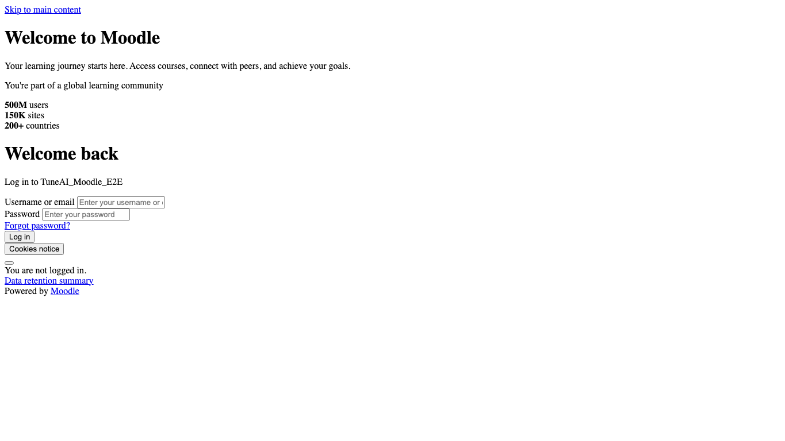
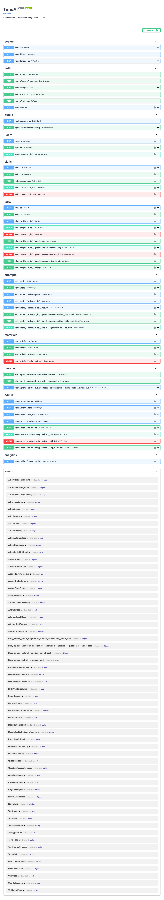

# Интеграция с Moodle

TuneAI предоставляет service API для Moodle-плагина или интеграционного скрипта на стороне Moodle.

Moodle может:

- записывать устный ответ и отправлять аудио в TuneAI;
- брать уже введенный текстовый ответ из Moodle и отправлять его на проверку;
- получать результат проверки;
- выставлять оценку обратно в Moodle Gradebook;
- показывать преподавателю сигнал, если нужна ручная проверка.



В текущем коде реализована backend-интеграция и Docker smoke-тест на реальном Moodle-контейнере. Готового Moodle plugin UI в репозитории пока нет: его нужно собрать поверх endpoints ниже.

В репозитории также есть заготовка Moodle local plugin: [integrations/moodle/local_tuneai](../integrations/moodle/local_tuneai). Ее можно положить в чужой Moodle как `local/tuneai` и использовать как основу для настройки mapping и отправки ответов.

## Включение

```env
MOODLE_INTEGRATION_ENABLED=true
MOODLE_INTEGRATION_TOKEN=<shared-service-token>
```

Каждый запрос должен передавать header:

```text
X-TuneAI-Integration-Key: <shared-service-token>
```

Service token хранится только на стороне Moodle или интеграционного backend. Не передавайте его в браузер студента.



## Установка заготовки плагина в чужой Moodle

1. Скопируйте каталог `integrations/moodle/local_tuneai` в Moodle как `local/tuneai`.
2. Откройте админку Moodle и завершите установку local plugin.
3. В настройках `Site administration -> Plugins -> Local plugins -> TuneAI integration` укажите:
   - `TuneAI base URL`;
   - `TuneAI integration key`;
   - `Enable TuneAI`.
4. На стороне TuneAI включите:

```env
MOODLE_INTEGRATION_ENABLED=true
MOODLE_INTEGRATION_TOKEN=<same-service-token>
```

Заготовка содержит:

- таблицу `local_tuneai_map` для mapping Moodle course/activity/question/group -> TuneAI test/question/methodist;
- таблицу `local_tuneai_submission` для зеркала статуса проверки;
- capabilities `local/tuneai:manage`, `local/tuneai:submit`, `local/tuneai:viewresults`;
- `client.php` для вызова TuneAI;
- `question_reader.php` для чтения Moodle `question_attempts`;
- `submission_service.php` для отправки ответа в TuneAI.

## Связка Moodle и TuneAI

Минимальная модель данных на стороне Moodle:

- Moodle course id;
- Moodle activity id, например quiz, assignment или custom activity;
- Moodle question id или slot id;
- Moodle group id, если один и тот же вопрос в разных группах должен вести в разные TuneAI тесты;
- TuneAI `test_id`;
- TuneAI `question_id`;
- правила выставления оценки в Gradebook;
- политика ручной проверки при `teacher_signal`.

Связку лучше хранить в настройках Moodle activity. Преподаватель выбирает опубликованный TuneAI test, затем сопоставляет каждый Moodle question с TuneAI question.

Перед настройкой mapping Moodle может запросить TuneAI manifest:

```text
GET /integrations/moodle/manifest?methodist_email=methodist@example.edu
```

Ответ содержит опубликованные тесты владельца и список вопросов. Это нужно, чтобы Moodle не просил администратора вручную копировать id и не позволял случайно привязать вопрос к чужому тесту.

## Текстовый ответ

```text
POST /integrations/moodle/submissions/text
```

```json
{
  "external_submission_id": "quiz-7-attempt-12-question-3",
  "external_attempt_id": "quiz-7-attempt-12",
  "moodle_user_id": "42",
  "moodle_course_id": "course-10",
  "moodle_activity_id": "quiz-7",
  "moodle_group_id": "group-3",
  "moodle_group_name": "PI-101",
  "methodist_email": "methodist@example.edu",
  "user_email": "student@example.edu",
  "user_full_name": "Student Name",
  "test_id": "TuneAI test id",
  "question_id": "TuneAI question id",
  "text": "Student text answer from Moodle"
}
```

TuneAI создает или переиспользует пользователя Moodle как `examinee`, назначает опубликованный тест, создает попытку и ставит ответ в тот же outbox/worker pipeline, что и обычные ответы TuneAI.

`external_submission_id` работает как idempotency key. Повтор такого же запроса вернет существующий answer/result.

Если `methodist_email` указан, TuneAI проверяет, что `test_id` принадлежит этому владельцу. Если Moodle отправит вопрос в чужой тест, API вернет `403`.

Текстовый сценарий для Moodle:

1. Студент отправляет ответ в Moodle.
2. Moodle plugin получает текст из question attempt или assignment submission.
3. Plugin вызывает `/integrations/moodle/submissions/text`.
4. Moodle показывает студенту статус обработки.
5. Plugin опрашивает result endpoint и сохраняет feedback.

## Голосовой ответ

```text
POST /integrations/moodle/submissions/audio
Content-Type: multipart/form-data
```

Поля:

- `external_submission_id`;
- `external_attempt_id`;
- `moodle_user_id`;
- `moodle_course_id`;
- `moodle_activity_id`;
- `moodle_group_id`;
- `moodle_group_name`;
- `methodist_email`;
- `user_email`;
- `user_full_name`;
- `test_id`;
- `question_id`;
- `file`.

Moodle-плагин должен запросить доступ к микрофону внутри Moodle, записать ответ и загрузить `audio/webm`, `audio/ogg`, `audio/mpeg`, `audio/mp4` или `audio/wav`.

Голосовой сценарий для Moodle:

1. В Moodle activity появляется кнопка записи ответа.
2. Browser запрашивает разрешение на микрофон.
3. Plugin записывает аудио через MediaRecorder.
4. Plugin отправляет файл на Moodle backend.
5. Moodle backend вызывает `/integrations/moodle/submissions/audio` с service token.
6. TuneAI сохраняет файл, ставит outbox job и возвращает текущее состояние submission.

Не отправляйте `X-TuneAI-Integration-Key` напрямую из браузера. Браузер должен общаться с Moodle backend, а Moodle backend уже вызывает TuneAI.

## Получение результата

```text
GET /integrations/moodle/submissions/{external_submission_id}/result
```

Поля ответа, которые нужны Moodle:

- `result_ready`: закончила ли TuneAI AI-проверку;
- `score`: баллы для выставления;
- `max_score`: максимум баллов;
- `grade`: нормализованная оценка от `0` до `1`;
- `feedback`: комментарий AI для Moodle;
- `review_required`: нужна ли ручная проверка преподавателем;
- `teacher_signal`: `none`, `review_recommended` или `processing_failed`;
- `review_reason`: причина сигнала для преподавателя;
- `confidence`: уверенность AI.

Moodle должен выставлять `grade` или `score/max_score` в Gradebook только при `result_ready=true`. Если `teacher_signal != "none"`, Moodle может сохранить AI-результат, но должен пометить работу для ручной проверки преподавателем.

Пример логики:

```text
if result_ready=false:
  keep submission in processing state

if result_ready=true and teacher_signal=none:
  write grade and feedback to Gradebook

if result_ready=true and teacher_signal!=none:
  write provisional grade
  mark submission for teacher review
  show review_reason to teacher
```

## Рекомендуемый flow

1. Преподаватель связывает Moodle activity/question с TuneAI `test_id` и `question_id`.
2. Студент надиктовывает ответ в Moodle или отправляет текст.
3. Moodle отправляет ответ в TuneAI со стабильным `external_submission_id`.
4. Moodle опрашивает result endpoint.
5. Moodle записывает оценку и feedback.
6. Moodle ставит сигнал преподавателю, если `review_required=true`.

TuneAI принимает submissions только для опубликованных тестов.

## Что должен делать Moodle plugin

- Страница настроек activity: загрузить manifest, выбрать TuneAI test и сопоставить вопросы.
- Mapping repository: учитывать `courseid`, `cmid`, `questionid` и опциональный `groupid`.
- UI прохождения: показать текстовый ответ или кнопку записи голоса.
- Backend controller: принять submission от Moodle, вызвать TuneAI service API.
- Scheduled task: периодически опрашивать result endpoint.
- Gradebook adapter: выставить оценку, feedback и статус ручной проверки.
- Teacher view: показать `teacher_signal`, `review_reason`, confidence и AI feedback.

Заготовка `local_tuneai` уже дает базовые классы для этих действий. UI форм настройки и scheduled task остаются следующим шагом реализации Moodle plugin.

## E2E-проверка с Moodle в Docker

Для локальной проверки можно поднять TuneAI, worker, RabbitMQ, PostgreSQL и настоящий Moodle-контейнер:

```bash
tests/moodle/run-moodle-e2e.sh
```

Сценарий:

- поднимает отдельный compose project `tuneai-moodle-e2e`;
- включает mock AI и Moodle integration token только для этого прогона;
- ждет готовности backend и Moodle;
- запускает PHP smoke-тест внутри Moodle-контейнера;
- создает demo exam в TuneAI;
- отправляет текстовый Moodle submission;
- проверяет idempotency повтора;
- дожидается результата worker pipeline;
- валидирует `score`, `max_score`, `grade`, `feedback`, `confidence` и `teacher_signal`.

После успешного или неуспешного прогона runner удаляет контейнеры и volumes. Чтобы оставить окружение для ручной диагностики:

```bash
KEEP_MOODLE_E2E=1 tests/moodle/run-moodle-e2e.sh
```

Когда `KEEP_MOODLE_E2E=1`, Moodle остается доступен на [http://localhost:18080](http://localhost:18080). Демо-логин контейнера:

```text
admin / moodle-e2e-admin-password
```

После ручной проверки остановите окружение:

```bash
docker compose -p tuneai-moodle-e2e -f docker-compose.yml -f docker-compose.moodle.yml down -v
```

После первого успешного build можно ускорить повторный прогон:

```bash
MOODLE_E2E_SKIP_BUILD=1 tests/moodle/run-moodle-e2e.sh
```

Успешный smoke подтверждает, что Moodle-контейнер смог вызвать TuneAI, отправить текстовый ответ, получить idempotent replay и дождаться результата worker pipeline.
