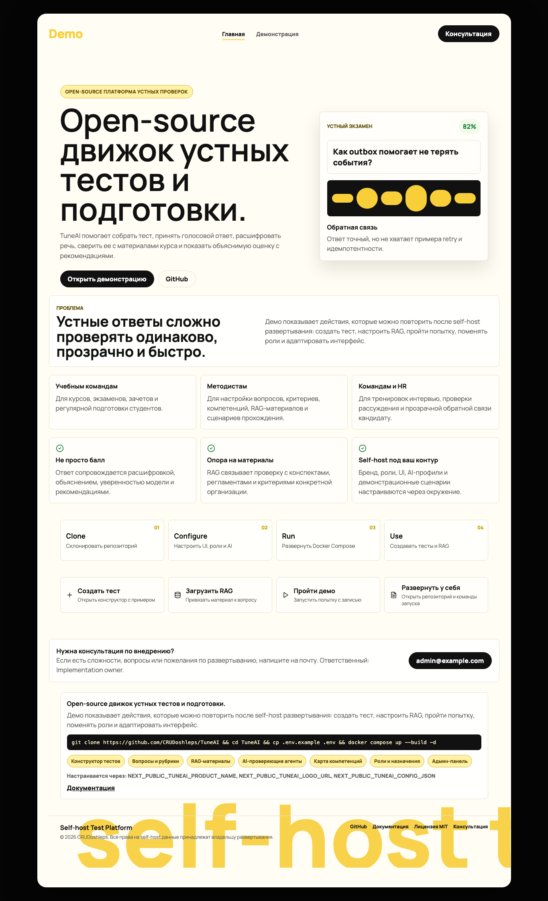
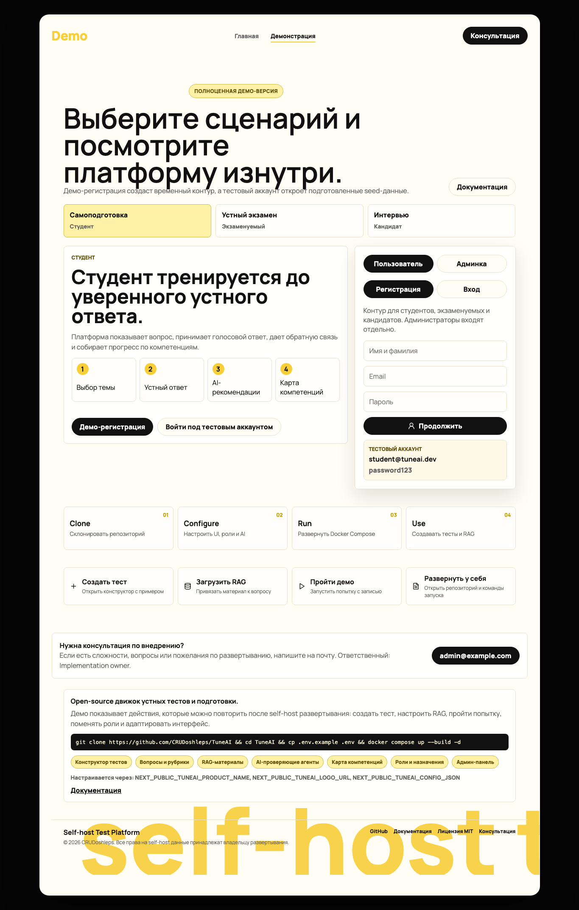
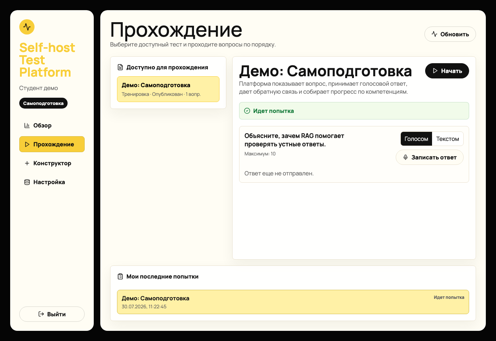

# Интеграция во внешние сайты и widget

TuneAI можно подключать к внешнему сайту двумя способами:

- встроить `/widget` как iframe-клиент для входа и прохождения назначенного теста;
- отправлять ответы через API из своего backend или frontend-клиента.

Для школы, курса или команды рекомендуемый вариант - поднять TuneAI на своем домене и встроить страницу `/widget`. В текущем коде нет отдельного JavaScript SDK. Служебные ключи и AI credentials остаются только на backend TuneAI.



## Быстрый локальный запуск

```bash
cp .env.example .env
docker compose up --build -d
docker compose --profile demo run --rm seed
```

Открывайте frontend как `http://localhost:3000`. В Next.js dev-режиме адрес `127.0.0.1` может блокировать служебные dev-ресурсы, из-за чего клики по демо-кнопкам работают некорректно.



## Встраивание виджета

Этот вариант подходит, если на внешнем сайте уже есть личный кабинет, а прохождение assessment нужно показать внутри него.

1. Поднимите TuneAI на отдельном домене, например `https://tuneai.example.edu`.
2. Настройте бренд через `NEXT_PUBLIC_TUNEAI_LOGO_TEXT`, `NEXT_PUBLIC_TUNEAI_LOGO_URL` и переменные цветов `NEXT_PUBLIC_TUNEAI_*_COLOR` или через `NEXT_PUBLIC_TUNEAI_CONFIG_JSON`.
3. Добавьте домен внешней платформы в `CORS_ORIGINS`, чтобы браузер мог вызывать API.
4. Добавьте домен внешней платформы в `EMBED_ALLOWED_ORIGINS` и `NEXT_PUBLIC_TUNEAI_EMBED_ALLOWED_ORIGINS`, чтобы `/widget` можно было открыть в iframe.
5. Назначьте тест пользователю или группе в админке.
6. На внешнем сайте вставьте iframe.

```html
<iframe
  src="https://tuneai.example.edu/widget?test_id=<optional-test-id>"
  title="Assessment"
  allow="microphone"
  style="width: 100%; min-height: 760px; border: 0;"
></iframe>
```

Если `test_id` указан, виджет откроет конкретный назначенный тест. Если пользователь вошел под аккаунтом без назначения на этот тест, он увидит пустое состояние, а не содержимое теста.

Для записи голосового ответа iframe должен получать разрешение `allow="microphone"`, а внешний сайт и TuneAI должны работать по HTTPS. На localhost браузеры обычно разрешают микрофон без HTTPS.

Виджет использует те же настройки бренда, что и основной сайт: логотип, цвета, название продукта и публичные тексты. Менять отдельную тему для iframe не нужно.

Пример production-настроек:

```env
CORS_ORIGINS=https://school.example.edu
EMBED_ALLOWED_ORIGINS=https://school.example.edu
NEXT_PUBLIC_TUNEAI_EMBED_ALLOWED_ORIGINS=https://school.example.edu
NEXT_PUBLIC_TUNEAI_LOGO_TEXT=Faculty Exams
NEXT_PUBLIC_TUNEAI_LOGO_URL=https://school.example.edu/assets/logo.svg
NEXT_PUBLIC_TUNEAI_ACCENT_COLOR=#ffcc13
NEXT_PUBLIC_TUNEAI_SURFACE_COLOR=#fffdf4
NEXT_PUBLIC_TUNEAI_PANEL_COLOR=#ffffff
NEXT_PUBLIC_TUNEAI_TEXT_COLOR=#111111
```



## API-интеграция

Этот вариант подходит для HR-платформ, образовательных порталов и отдельных сайтов с экзаменами, где UI уже есть, а TuneAI нужен как сервис проверки.

### 1. Авторизация

Обычные пользователи регистрируются или входят через публичные endpoints:

```text
POST /auth/register
POST /auth/login
```

Администраторы используют отдельный контур:

```text
POST /auth/admin/login
```

Не смешивайте публичные аккаунты студентов, кандидатов и экзаменуемых с админкой.

### 2. Создание попытки

После выбора теста внешний клиент создает попытку:

```http
POST /attempts
Authorization: Bearer <user-access-token>
Content-Type: application/json

{
  "test_id": "test-id"
}
```

Ответ содержит `attempt_id`, доступные вопросы и текущий статус. Для студента или кандидата API не раскрывает будущие вопросы до того, как они станут доступны.

Каждый вопрос содержит поле `answer_mode`:

| Значение | Что разрешено |
| --- | --- |
| `audio` | Только голосовой ответ |
| `text` | Только текстовый ответ |
| `both` | Голосовой или текстовый ответ |

Внешний клиент должен скрывать или блокировать неподходящий способ ответа. Backend тоже проверяет это правило: audio-only вопрос не примет текст, text-only вопрос не примет аудио.

### 3. Отправка текстового ответа

```http
POST /attempts/{attempt_id}/questions/{question_id}/text
Authorization: Bearer <user-access-token>
Idempotency-Key: <client-generated-key>
Content-Type: application/json

{
  "text": "Ответ пользователя"
}
```

`Idempotency-Key` нужно генерировать на клиенте для каждой отправки. Если сеть оборвалась и запрос повторился с тем же ключом, backend вернет уже созданный answer/result, а не создаст дубль.

### 4. Отправка голосового ответа

```http
POST /attempts/{attempt_id}/questions/{question_id}/audio
Authorization: Bearer <user-access-token>
Idempotency-Key: <client-generated-key>
Content-Type: multipart/form-data

audio=<audio/webm | audio/ogg | audio/mpeg | audio/mp4 | audio/wav>
```

Frontend внешнего сайта должен запросить доступ к микрофону, записать файл и отправить его как multipart file. Для браузерной интеграции добавьте внешний домен в `CORS_ORIGINS`; backend уже разрешает headers `Authorization`, `Content-Type`, `Idempotency-Key`, `X-Request-ID`.

### 5. Получение результата

```http
GET /attempts/{attempt_id}/result
Authorization: Bearer <user-access-token>
```

Результат появляется после фоновой обработки worker. В ответе есть баллы, feedback, расшифровка, источники RAG, confidence, компетенции и сигнал ручной проверки.

## Рекомендованный UX внешнего сайта

1. Пользователь открывает страницу экзамена или интервью на вашей платформе.
2. Платформа показывает краткий контекст, правила и кнопку начала.
3. Backend вашей платформы создает или выбирает пользователя TuneAI и назначенный тест.
4. Frontend создает попытку и показывает первый доступный вопрос.
5. Страница показывает только те способы ответа, которые разрешены текущим вопросом.
6. Frontend отправляет ответ с `Idempotency-Key` и сразу показывает статус обработки.
7. Страница периодически запрашивает `/attempts/{attempt_id}/result`.
8. После готовности показывает оценку, feedback и предупреждение, если нужна ручная проверка.

## Безопасность

- Не отдавайте в браузер Yandex API keys, service tokens Moodle, admin password и credentials внешних моделей.
- Для service-to-service интеграций используйте backend внешней платформы.
- Ограничивайте видимость тестов назначениями и ролями.
- Для iframe не используйте `X-Frame-Options: DENY`; вместо этого задавайте `Content-Security-Policy: frame-ancestors 'self' https://your-site.example`.
- Для production отключайте публичный demo bootstrap: `DEMO_BOOTSTRAP_ENABLED=false`.
- Добавляйте cleanup временных пользователей и тестов для демо-контуров.

## Если позже понадобится widget SDK

Отдельный widget SDK можно сделать позже. Минимальный контракт:

- npm-пакет или один JS bundle;
- `mount(container, config)` для встраивания;
- настройки темы, текста, бренда и сценария;
- callback-и `onReady`, `onAnswerSubmitted`, `onResult`, `onError`;
- поддержка `audio`, `text` и `both` для вопросов;
- безопасная авторизация через короткоживущий token, выданный backend внешнего сайта.
